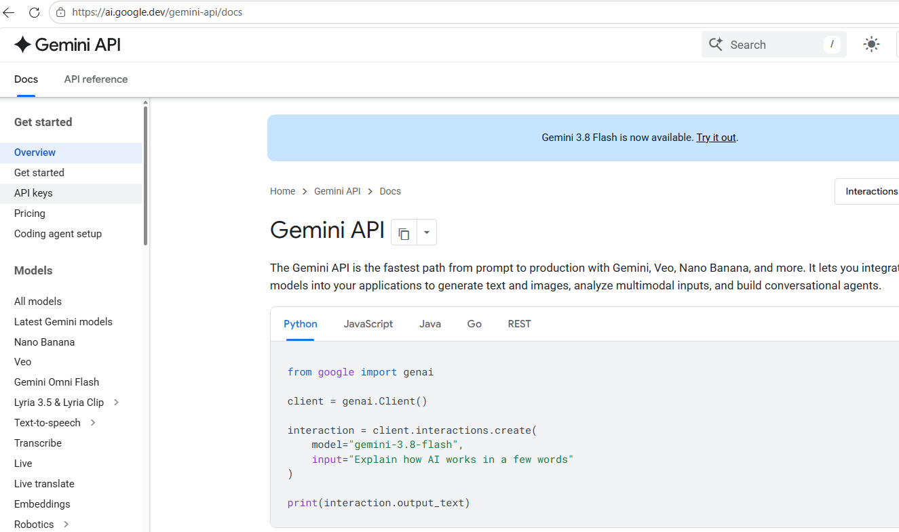
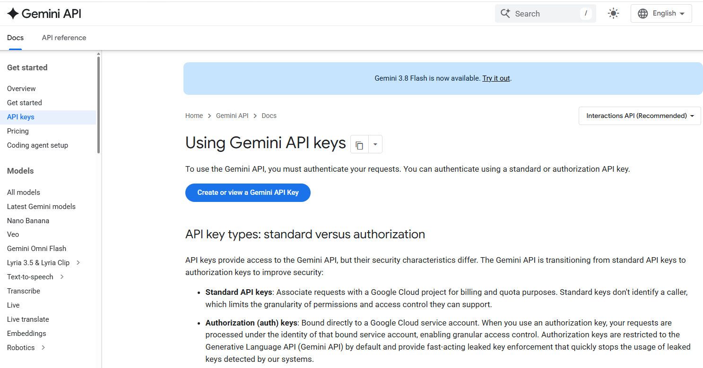
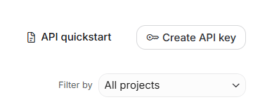
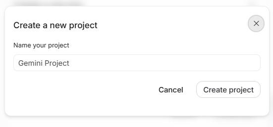
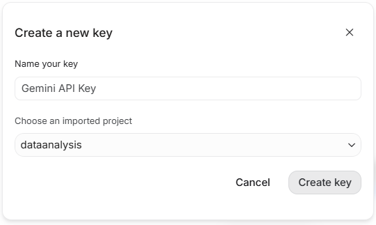
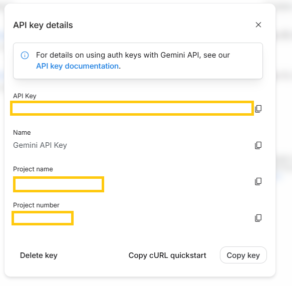
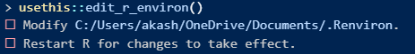

# Generate Gemini API

#### Step-1: Visit "https://ai.google.dev/gemini-api/docs"


#### Step-2: Create API Key by login to your gmail account


#### Step-3: Click on "Create API Key" on the top right corner


#### Step-4: Create new project


#### Step-5: Give a name and click create


#### Step-6: Copy the API Key


# Add API key in R/ R Studio / Positron
```{r}
#| eval: false
# in R console type the following. This will open the .Renviron file
usethis::edit_r_environ()
```


#### Paste the API Key in the .Renviron after typing "GEMINI_API_KEY="


```{r}
#| include: false
library(ellmer)
library(magick)
library(Statamarkdown)
library(knitr)
```

# Load Necessary Packages

###### The ellmer package is used to initiate chat with Gemini
```{r}
#| eval: false
#| echo: true
library(ellmer)
library(magick)
libraty(ggplot2)
library(dplyr)
library(Statamarkdown)
library(knitr)
```

# Automatic AI Analysis of Graph from R

```{r}
#| include: false
#| cache: true
plot1<-ggplot(data=mtcars,aes(x=mpg,y=wt,col=mpg))+
    geom_point(size=5)
figure1<-"figure1.png"
ggsave(figure1,plot=plot1)

chat1<-chat_google_gemini(
    model="gemini-3.1-flash-lite"
)
ai_output1<-chat1$chat(
    content_image_file(figure1),
    "Describe the plot.
    Write in journal publication standard.
    Do not write unnecessary things.
    Make no mistake"
)
```

```{r}
#| eval: false
#| echo: true
#| cache: true
# Use ggplot2 and mtcars data to plot a scatter plot
plot1<-ggplot(data=mtcars,aes(x=mpg,y=wt,col=mpg))+
    geom_point(size=5)

# Save the plot
figure1<-"figure1.png"
ggsave(figure1,plot=plot1)

# Begine the chat using gemini-3.1
chat1<-chat_google_gemini(
    model="gemini-3.1-flash-lite"
)

# Create AI output with the saved R plot and custom prompt
ai_output1<-chat1$chat(
    content_image_file(figure1),
    "Describe the plot.
    Write in journal publication standard.
    Do not write unnecessary things.
    Make no mistake"
)
```

```{r}
#| echo: false
#| context: setup
#| warning: false
#| message: false
plot1
```
```{r, results='asis'}
#| echo: false
#| context: setup
#| warning: false
#| message: false
ai_output1
```

# Automatic AI Analysis of Regression Result from R

```{r}
#| include: false
#| cache: true
model1<-lm(mpg~wt+factor(gear),data=mtcars)
model1_result<-capture.output(summary(model1))
chat1<-chat_google_gemini(
    model="gemini-3.1-flash-lite"
)
prompt_reg<-paste(model1_result,
"Analyse this regression result.
Write the regression result in a single paragraph.
Write in full professional publication grade.
Make no mistake."
)

# Create AL output
ai_output2<-chat1$chat(prompt_reg)
```
```{r}
#| eval: false
#| cache: true
#| echo: true
# Regression Analysis R
model1<-lm(mpg~wt+factor(gear),data=mtcars)

# Summarise the regression model1_result
summary(model1)

# Capture the output of the regression result
model1_result<-capture.output(summary(model1))

# Begine the chat using gemini-3.1
chat1<-chat_google_gemini(
    model="gemini-3.1-flash-lite"
)

# Create Custome prompt with the captured regression result
prompt_reg<-paste(model1_result,
"Analyse this regression result.
Write the regression result in a single paragraph.
Write in full professional publication grade.
Make no mistake."
)

# Create AI output analysis of the regression
ai_output2<-chat1$chat(prompt_reg)
```
```{r}
#| echo: false
summary(model1)
```

```{r}
#| echo: false
#| results: asis
ai_output2<-chat1$chat(prompt_reg)
```

# Automatic AI Analysis of Regression Result from STATA in Quarto

```{stata, collectcode=TRUE}
*| include: false
sysuse nlsw88, clear
log using "reg_stata.txt", text replace
regress wage ttl_exp i.race i.married
log close
```
```{r, results="asis"}
#| include: false
#| cache: true
reg_output_stata<- readLines("reg_stata.txt")
stata_text<-paste(reg_output_stata, collapse = "\n")
prompt_stata_reg<-paste(
    stata_text, 
    "Analyse this STATA regression result.
    Write the regression result in a single paragraph.
    Write in full professional publication grade.
    Make no mistake."
)
chat1<-chat_google_gemini(
    model="gemini-3.1-flash-lite"
)
ai_output3<-chat1$chat(prompt_stata_reg)
```


#### STATA Chunk
```{stata, collectcode=TRUE}
*| eval: false
*| echo: true
# Load nlsw88 data in stata
sysuse nlsw88, clear

# Store the STATA result log file in txt format
log using "reg_stata.txt", text replace

# Perform the linear regression in STATA
regress wage ttl_exp i.race i.married

# Log close
log close
```

#### R Chunk

```{r, results="asis"}
#| eval: false
#| cache: true
# Import the STATA result in R
reg_output_stata<- readLines("reg_stata.txt")
stata_text<-paste(reg_output_stata, collapse = "\n")

# Begine the chat using gemini-3.1

chat1<-chat_google_gemini(
    model="gemini-3.1-flash-lite"
)

# Create Custom Prompt also include the STATA result 
prompt_stata_reg<-paste(
    stata_text, 
    "Analyse this STATA regression result.
    Write the regression result in a single paragraph.
    Write in full professional publication grade.
    Make no mistake."
)

# Create AI output analysis of the STATA regression result
ai_output3<-chat1$chat(prompt_stata_reg)
```

```{stata, collectcode=TRUE, echo=FALSE, message=FALSE, warning=FALSE}
sysuse nlsw88, clear
log using "reg_stata.txt", text replace
regress wage ttl_exp i.race i.married
log close
```
```{r, results='asis'}
#| echo: false
ai_output3<-chat1$chat(prompt_stata_reg)
```